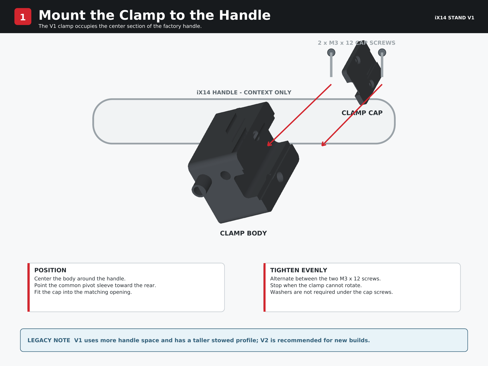
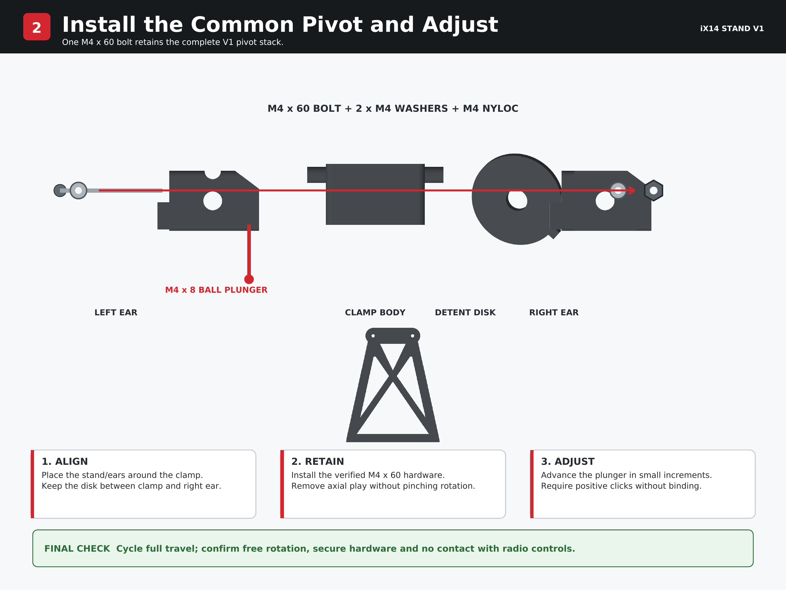

# Assembly Instructions - iX14 Stand V1

[Download the printable two-stage assembly guide (PDF)](../exploded-view/ix14-v1-assembly-guide.pdf)

V1 is the original external-handle prototype. It was physically fit-tested and used successfully in PLA, but development moved to V2 because V2 is easier to install, more compact, more adjustable and leaves more of the carrying handle open. **New builders should use V2 unless they specifically want to reproduce the original design.**

> **Hardware status:** the V1 printed parts, clamp fit, pivot, stand attachment and overall motion were physically validated. Final behavior with the production M4 x 8 spring-loaded ball plunger remains pending arrival of that hardware.

## Printed parts

| Quantity | Part |
| ---: | --- |
| 1 | Clamp body |
| 1 | Clamp cap |
| 1 | Left ear with ball-plunger access relief |
| 1 | Right detent ear |
| 1 | Keyed detent disk |
| 1 | Stand |

Use the [V1 buy list](<../../buy-list/iX14 Stand v1 — Buy List.md>) for the complete hardware list. The physically verified common pivot bolt is **M4 x 60 mm**; a 65 mm bolt is unnecessarily long.

## Printing notes

V1 was prototyped in PLA using the supplied Bambu Studio project and largely default Bambu PLA Basic / 0.20 mm Standard settings. The project contains four plates: the clamp and ears, detent disk, single-color stand and multicolor stand.

- Use a 0.4 mm nozzle and 0.20 mm layer height.
- Use the supplied 3MF orientations and inspect the sliced preview before printing.
- Do not scale any part.
- Confirm supports, brim, printer, plate and filament assignments for your machine.
- Inspect all parts for weak layers, cracks or malformed holes before assembly.

## Insert locations

Install all heat-set inserts before mounting anything to the radio.

- **2 x M3 inserts:** the two cap-screw pockets in the clamp body
- **2 x M3 inserts:** one stand-mounting pocket in each ear
- **1 x M4 insert:** the ball-plunger bore in the clamp body

Use the alignment feature supplied with your heat-set tool whenever one is available. If your setup does not provide an alignment solution, an appropriate screw may be threaded loosely into the insert to help keep it straight. Allow each part to cool completely before applying load.

## 1. Mount the clamp to the handle

1. Position the clamp body around the center section of the iX14 handle with the pivot sleeve facing the rear of the radio.
2. Fit the clamp cap into the matching body opening.
3. Install two M3 x 12 screws through the cap and into the M3 inserts in the clamp body.
4. Tighten the screws evenly, alternating between them so the cap seats uniformly.
5. Stop when the clamp is secure and cannot rotate on the handle.

Washers are not required under the clamp-cap screws. Do not overtighten the clamp against the radio handle.

## 2. Assemble the stand and install the common pivot

1. Identify the left ear by its half-round ball-plunger access relief and the right ear by its keyed detent-disk interface.
2. Attach each ear behind the corresponding upper stand hole using one M3 x 8 screw and M3 washer per side. The stand header and mounting holes belong at the top.
3. Seat the keyed detent disk fully on the right ear without forcing it.
4. Position the completed stand-and-ear assembly around the clamp body and align the common pivot bore.
5. Keep the detent disk between the right side of the clamp body and right ear, with its pockets facing the ball plunger.
6. Fit one M4 washer under the head of the verified M4 x 60 pivot bolt and pass the bolt through the complete pivot stack.
7. Fit the second M4 washer and M4 Nyloc nut on the threaded end.
8. Tighten only until axial play is removed. The stand must still rotate freely.

## 3. Install and adjust the ball plunger

1. Use the relief in the left ear to access the M4 insert in the clamp body.
2. Thread the M4 x 8 spring-loaded ball plunger into the insert.
3. Rotate the stand slowly while advancing the plunger in small increments.
4. Stop when the ball engages the detent pockets positively without making the pivot difficult to rotate.
5. Cycle the stand through its full travel and confirm consistent engagement.

Do not use permanent threadlocker. Complete initial adjustment and wear-in testing before deciding whether any removable retention method is necessary.

## Final inspection

- Clamp body and cap are seated evenly and cannot rotate on the handle
- Both M3 x 12 clamp screws are secure
- Both M3 x 8 stand screws have washers and are secure
- M4 x 60 pivot bolt has a washer at both ends and the Nyloc nut is secure
- Stand rotates freely without axial looseness
- Detent disk remains fully keyed to the right ear
- Ball plunger engages consistently without binding
- Stand supports the radio at the intended angle
- Stand folds without contacting the radio body, switches or controls

## Safety and maintenance

- This is a desk/simulator stand, not a replacement carrying handle.
- V1 occupies more of the handle area and has a taller stowed profile than V2.
- Inspect the printed parts, inserts and fasteners periodically for cracks, loosening or wear.
- Never force the stand beyond its designed range of motion.
- Review the repository's [`DISCLAIMER.md`](../../../DISCLAIMER.md) before printing or using the design.
